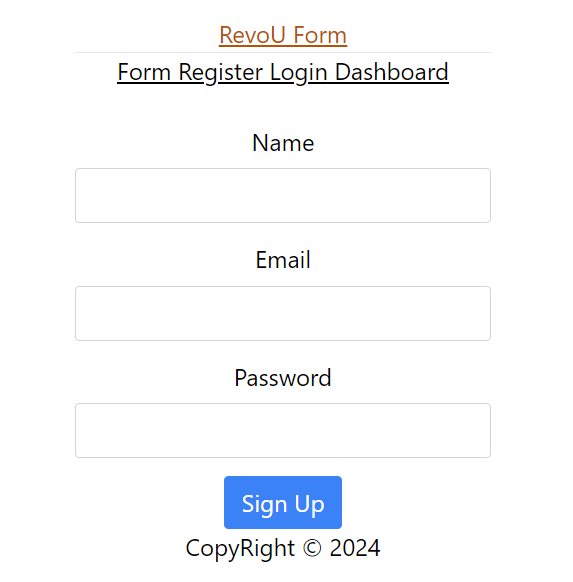

# Make Form Login and registrasi and dashboard input data to table

# installation

1. `npx create-react-app newfolder --template typescript` install react
2. react `npm i react-router-dom`
3. `npm i formik --save` `npm i yup -- save` for validation form
4. `npm i tailwindcss` design your web use tailwindcss full information you can follow
   `https://tailwindcss.com/docs/installation`
